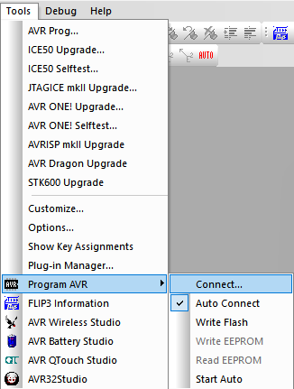
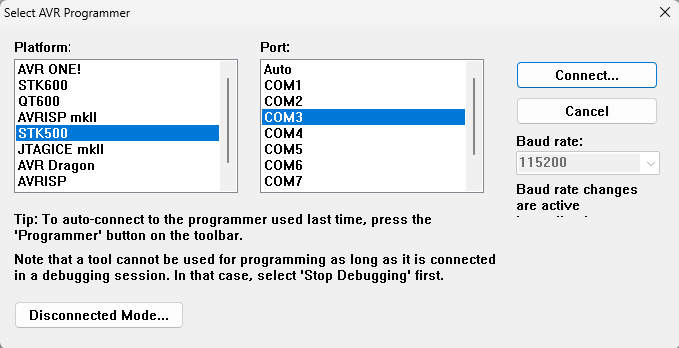
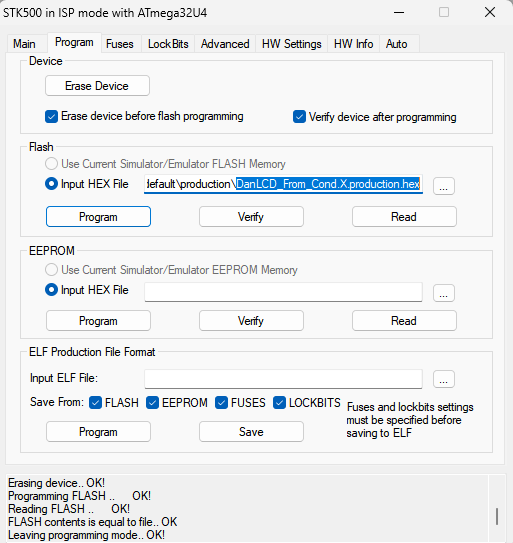
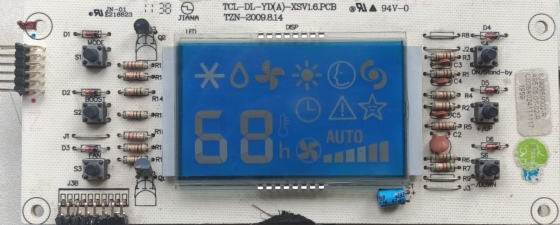
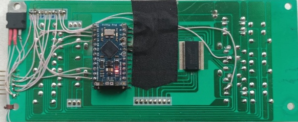

# Проєкт: LCD-контролер із кнопками на базі HT1621

Цей проєкт реалізує роботу з LCD-дисплеєм на базі контролера **HT1621** та обробку **6 кнопок**, з можливістю перемикання сегментів і виводу числової інформації. Реалізовано на мікроконтролері AVR з використанням **чистого C** і структурованої архітектури.

---

## 🧠 Функціонал

- Виведення двозначного числового значення (лічильник) на LCD-дисплей
- Робота з 6 кнопками, підключеними через мультиплексування SPI-ліній
- Перемикання окремих сегментів та повне ввімкнення/вимкнення всіх сегментів
- Підтримка таймера 1 сек. через переривання
- Чисте розділення по рівнях: HAL / Middleware / Application

---

## 📁 Структура проєкту

```txt
src/
├── main.c                 ← Головний файл з main(), ініціалізація системи
│
├── drivers/               ← Низькорівневі драйвери (HAL)
│   ├── board.h            ← Визначення пінів плати (конфігурація)
│   ├── buttons.c/h        ← Робота з кнопками: ініціалізація, опитування
│   ├── ht1621.c/h         ← Драйвер HT1621: надсилання команд та даних
│
├── middleware/            ← Логіка обробки та сервісні функції
│   ├── lcd_display.c/h    ← Вивід чисел і керування сегментами дисплея
│   ├── button_service.c/h ← Обробка подій натискань, debounce, callback
```

---

## ⚙️ Побудова проєкту

Проєкт розрахований на використання **MPLAB X**.  

---

## 🔘 Кнопки

| Кнопка | Призначення                           |
|--------|----------------------------------------|
| 0      | Перемикає сегменти COM1               |
| 1      | Перемикає сегменти COM2               |
| 2      | Перемикає сегменти COM3               |
| 3      | Перемикає сегменти COM4               |
| 4      | Ввімкнути всі сегменти COM1–COM4      |
| 5      | Вимкнути всі сегменти COM1–COM4       |

---

## 🛠️ Залежності

- **AVR Libc**
- Підтримка `F_CPU = 16 MHz`
- Компілятор `avr-gcc`
- [опційно] `make` або MPLAB X IDE для збирання

---

## 🔌 Завантаження прошивки в мікроконтролер

Оскільки програматор **AVR ISP 3.2** є несертифікованим (клон), середовище **MPLAB X IDE** не підтримує його напряму.  
Для прошивки використовується перевірене **AVR Studio 4** у режимі **STK500 + COM-порт**.

---

### 🧭 Кроки підключення:

1. Відкрити AVR Studio
2. Перейти в меню **Tools → Program AVR → Connect...**  
   
3. У вікні, що з’явилось:
   - Вибрати **Platform**: `STK500`
   - Вибрати **Port**: COM-порт, який використовує програматор (наприклад, `COM3`)
   - Натиснути **Connect**
   
   

4. Після підключення перейти на вкладку **Program**
5. У секції Flash:
   - Обрати `.hex` файл прошивки
   - Натиснути **Write Flash** для запису

   

---

### 🛠️ Поради:

- COM-порт можна перевірити в **Диспетчері пристроїв Windows** (`Ports (COM & LPT)`)
- Програматор повинен бути правильно підключений до мікроконтролера:  
  **MISO, MOSI, SCK, RESET, VCC, GND**

## 📸 Фото запрограмованої плати

Вигляд плати, яку ми програмували під час роботи з цим проєктом:

**Лицьова сторона (зі встановленим LCD-дисплеєм):**  


**Зворотна сторона (з проводами та мікроконтролером):**  


## 📝 Ліцензія

Проєкт наданий для демонстрації та освітнього використання.
